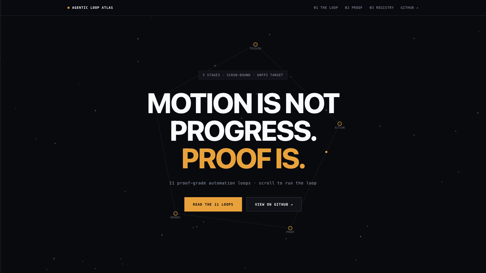

# Agentic Loop Atlas: live demo page

A single scroll-driven web page that walks through the loop contract (trigger, action, proof, memory, stop) and lists the 11 loop cards in this repository.

**Live demo:** https://mrsarac.github.io/awesome-agentic-loops/demo/



## How it works

- Everything is in `index.html`: HTML, CSS and plain JavaScript, with no build step, framework or external requests.
- The hero draws the five loop stages on a canvas. Each chapter below it explains one stage, and the proof chapter prints an illustrative receipt for AAL-LOOP-001 line by line as you scroll.
- The registry at the bottom is generated from a small list that mirrors `catalog.json` (id, name, category, risk level). Each card links to its loop card in [`loops/`](../../loops/).
- Animations only change `transform` and `opacity`. With "reduce motion" turned on in the operating system, the page shows every section without scroll effects.

GitHub Pages already serves this repository's `docs/` folder, so the page is published from `main` with no extra workflow.

## Run locally

```bash
cd docs/demo
python3 -m http.server 8000
# open http://localhost:8000
```

Opening `index.html` directly in a browser also works.

When you add or rename a loop, update the `LOOPS_DATA` list in `index.html` so the page stays in step with `catalog.json`.

## License

MIT, like the rest of the repository. See [LICENSE](../../LICENSE).
